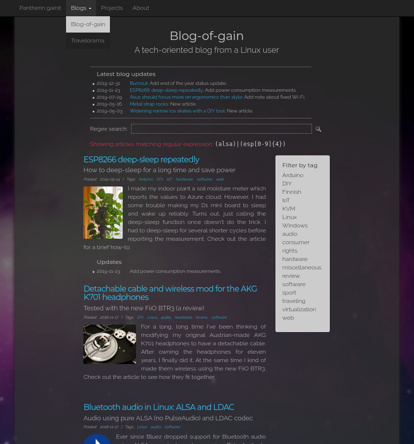

# GainCMS

GainCMS is a simple PHP blog engine for generic websites and blogs, influenced by Jekyll and Grav which are close but not as simple and effective as this. If all you need is a quick and simple CMS/blog with pagination and comments supports or a simple responsive web site, this might be a good base. Not by any means "user-friendly" in the modern dummy end user sense, if you have some dev skills or experience with CLI, GainCMS should be trivial to use and takes only a few minutes to get into.

## Feature list

* Simple and easy to modify
* Flat file blog CMS
* Responsive design (Bootstrap)
* Markdown articles (Parsedown)
* Disqus comments
* Pagination
* Tagging
* PHP routing
* Multiple blog support
* Simple visitor statistics

Sample screenshot from the original author's blog:


## Requirements and installation

Required software:

* **Apache** 2.2.16 or newer with **mod_rewrite** for *.htaccess* routing to work correctly.
* **PHP** 4.3 or newer.
* For statistics parsing (optional), Python 3 is required.

To get things running:

1. Install required software.
2. Copy the contents of this repository to your web server root directory (usually */var/www*).
3. Configure the `CONFIG_URL_BASE` variable (and optionally the `CONFIG_GITHUB_USER` and `CONFIG_URL_DISQUS` variables) in *index.php*.

## Structure explained

Below is a rough diagram of GainCMS structure, where + denotes a directory and - denotes a file. The first line of the diagram is the root directory.

```
+ /
 \
 |- .htaccess
 |- index.php
 |+ site/
   \
   |- about.php
   |- blog.php
   |- error.php
   |- home.php
   |- post.php
   |- projects.php
   |+ css/
   |+ files/
   |+ graphics/
   |+ includes/
   |
   |+ posts/
     \
     |+ 2015-08-26_example/
     | \
     | |- article.md
     | |- intro.md
     | |- tag_software
     | |- tag_spaces work too
     | |- tag_but_are_converted_anyway
     | |- thumb_woot.jpg
     | |- woot.jpg
     |+ _2015-11_26_unpublished/
       \
       |- article.md

```

The *index.php* contains the site configuration and works as a router. It breaks down the URL and shows the correct page (*about.php*, *blog.php* etc.). All requests are directed to *index.php* in *.htaccess*. Adding and removing subpages is therefore straightforward and there's no magic involved. Basically one can write a new page from scratch and it will be shown just like that. The configuration of blogs is also defined here.

In the *includes* directory there are the common header (which also contains the navigation bar) and footer along with other utilities (e.g. a Parsedown extension). The *css*, *graphics* and *files* directories contain the style definitions, images and icons, and various other files respectively.

Blog articles go to directories configured in *index.php*, by default to *posts*. Every article is contained in its own subdirectory, whose name must begin with a date in the `YYYY-MM-DD` format, with the exception of unpublished articles. Their directories begin with an underscore by default. The directory name of an article is also used as the ID for Disqus comments.

## Articles

Each blog article consists of the article itself in *article.md*, a short intro in *intro.md* (which shown in the blog post listing and social media shares), tags, and other files such as images if referred to in the article. The tags are just empty files whose names should begin with `tag_` by default. Spaces in tags are supported, but underscores are converted to spaces anyway in hyperlinks.

The paths and glob patterns are customizable in *index.php*.

There are two special tags to roughly control the layout of the pictures within the article:
* *<br>* inside an article paragraph will perform a clear for floating images.
* Emphasis using asterisks around an image will make the image full width. In Markdown, you would write `*[](thumb.jpg)*`.

## Visitor statistics

GainCMS has its own simple visitor statistics support so as not to give too much information to big corporations. To enable the visitor statistic, simply create the directory *DIR_STATS_BASE*, defined in *index.php*. Statistics may be parsed with the Python script *parse_stats.py*. You may also ignore IP addresses from the statistics: see `CONFIG_STATS_IP_IGNORE_FILE` in *index.php*. List one IP per line in the file. The addresses mentioned there won't be logged.

## Project goals by the original author

I made this CMS to have a simple yet flexible platform to write about things I've wanted to share. Some of these are for a very small audience (Linux audio for example), and some are just for my personal fun. Professionally, I wanted to have some experience on modern responsive web design. This CMS uses Bootstrap along with custom styles (e.g. responsive YouTube-video containers). I also wanted to see how routing works in practice.

## License

GainCMS uses Parsedown and Bootstrap, which are [MIT](http://opensource.org/licenses/MIT) licensed. The social media share icons are [CC](https://creativecommons.org/licenses/by/3.0/) by [Aha-Soft Team](http://www.aha-soft.com/free-icons/). GainCMS itself is [GPL-3.0](http://www.gnu.org/licenses/gpl-3.0.txt).
